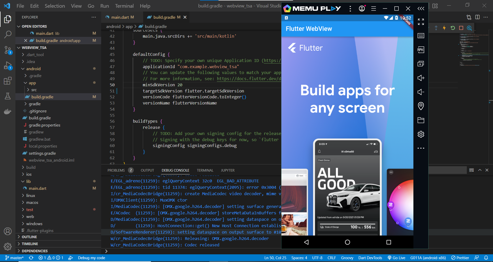
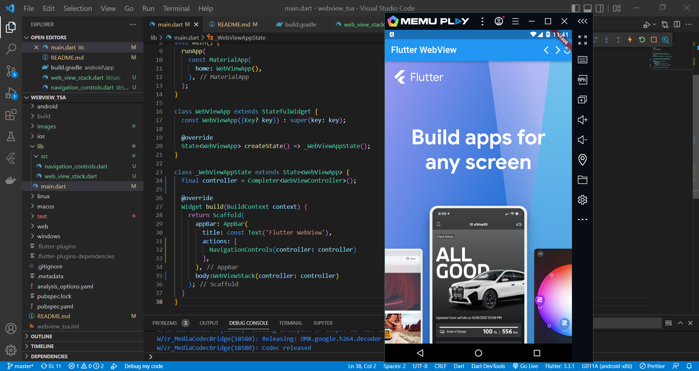
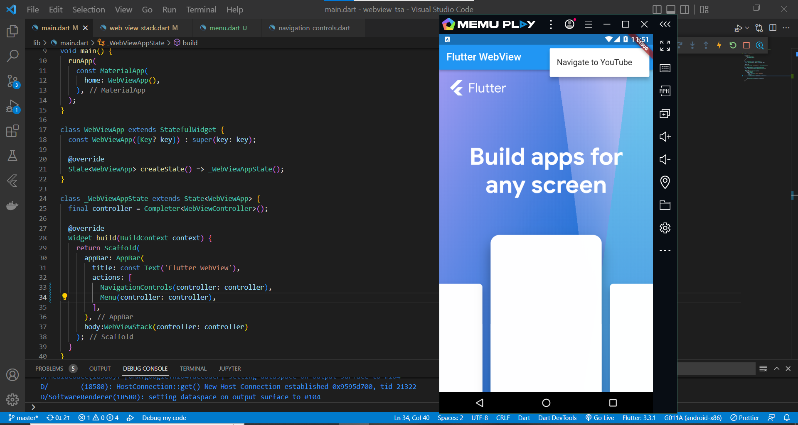
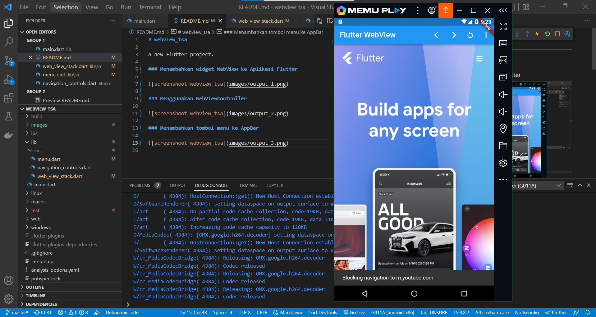
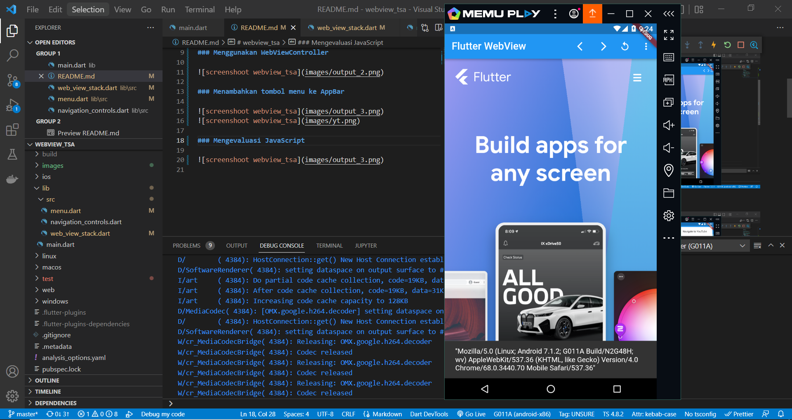
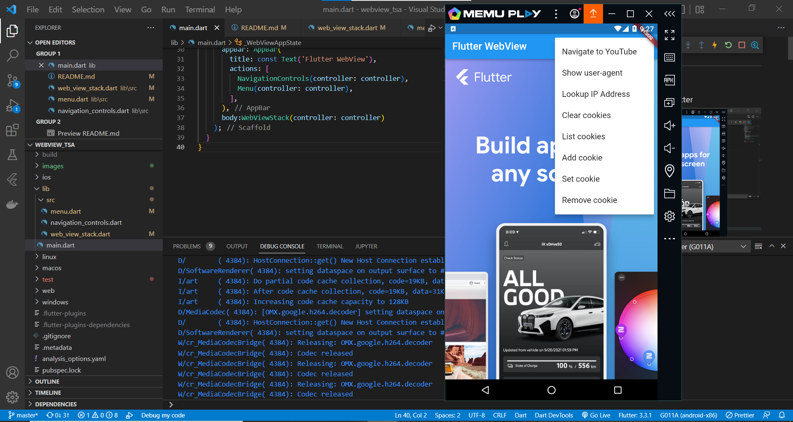
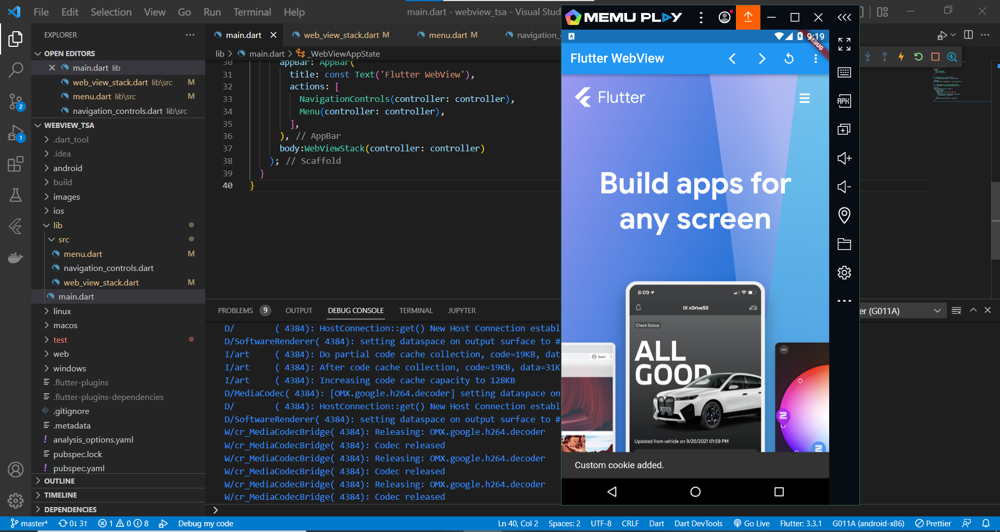
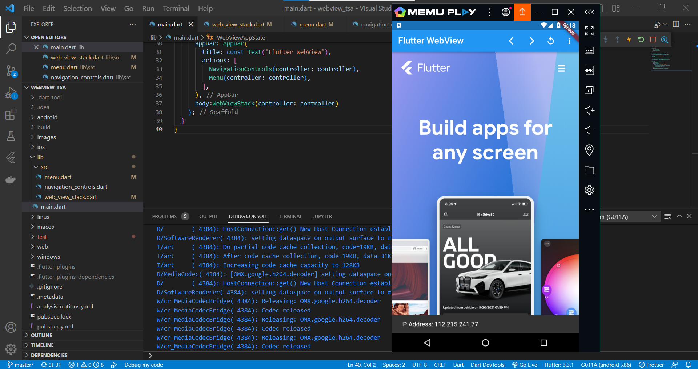

# webview_tsa

A new Flutter project.

### Menambahkan widget WebView ke Aplikasi Flutter

### Menggunakan WebViewController

### Menambahkan tombol menu ke AppBar

### Mengevaluasi JavaScript

### Mengelola Cookie

